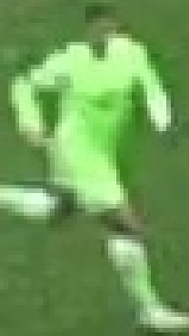
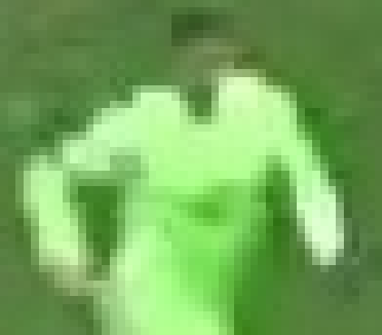
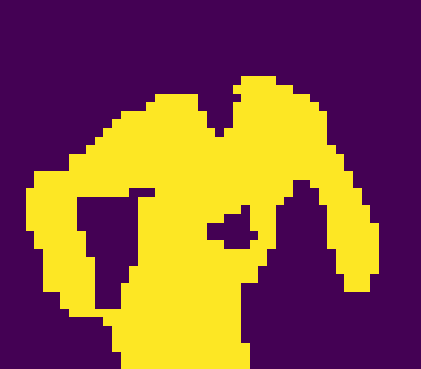
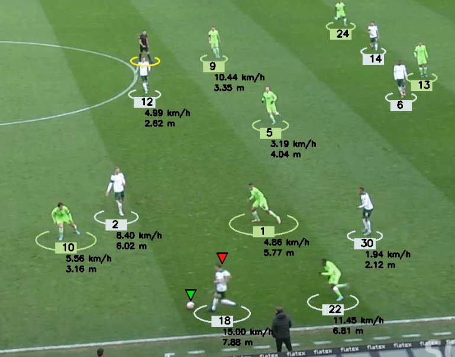
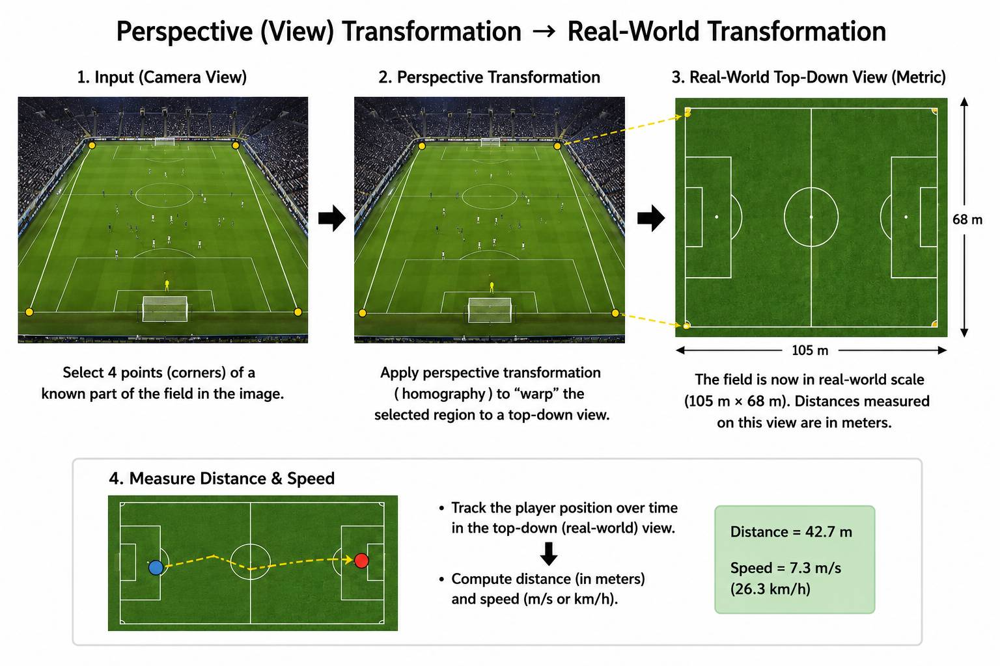
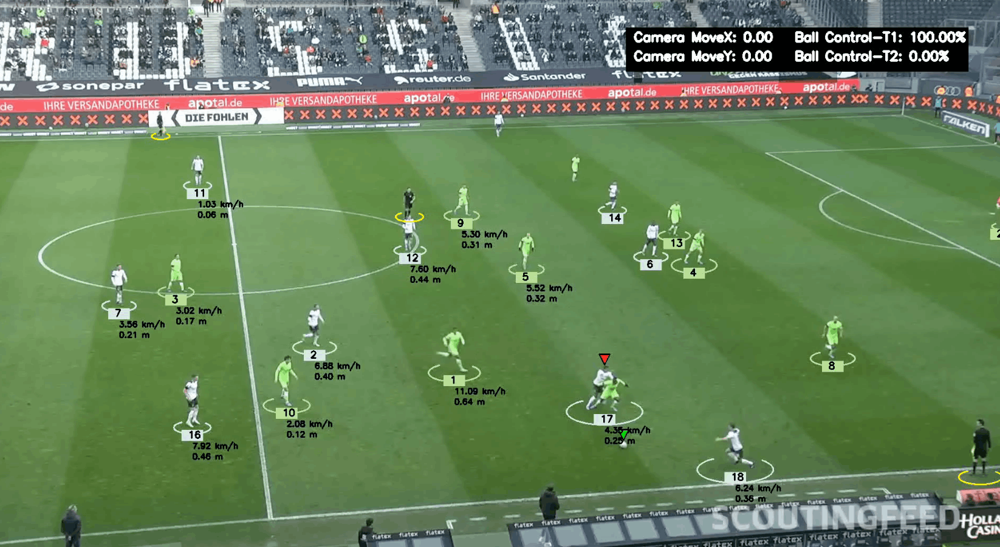

# DFL - Bundesliga Data Shootout Analysis using YOLO, OpenCV, and Python

As the initial inference of the YOLO model for detecting players and the ball on the pitch was not satisfactory, we fine-tuned YOLOv5 on a football dataset from Roboflow to detect players, referees, goalkeepers, and the ball. The trained model now excludes people outside the pitch, and the ball is detected more accurately.


Now is also the time to prepare the Tracker class that can tracks different objects througout the entrire video and all frames.

I many instance the goal keeper is also detected as a player and switches between these two classes. This might be du to the small training dataset and as we do not investigating any statistics on the goal keeper here we treat the goalkeeper as a layer also. 

#### `trackers`
Now, we want to make the annotations on the predicted video a bit neater, with information that is easier to follow. In the tracker.py file: 
- Draw a red elipse under each player proportionate with its bounding box width
- Draw a yellow elipse under the referees
- Put the players id (detected object id) also printed under the player
- Put a pointer on the ball

#### `team_assigner`
At this step, we want to seperate the players as team one and two based on the color of their shirts.
- Crop the image of each player using the bounding box.
- Tekae the top half of the image as always includes the T-shirt that seperates the teams by color.
- Now cluster the top half into two class of beckground and T-shirt color (using K-mean for the clustering)
- Take the color of the segmented player using K-mean of the center for all players at each frame
- Divide the all players color into only 2 teams again using K-means.
- A team id is assigned to each player and if theat is already decided for a player (by checking the player id) that team assigning would not be runned in the next frame.


<table>
  <tr>
    <td align="center">
      <br>
      <em style="font-size:12px;">Cropping all players.</em>
    </td>
    <td align="center">
      <br>
      <em style="font-size:12px;">To assign the team based on the shirt, crop the top half of the image.</em>
    </td>
    <td align="center">
      <br>
      <em style="font-size:12px;">Seperate the T-shirt from the background color to decide the team.</em>
    </td>
  </tr>
</table>


Now, since the ball is not detected in every frames and the fact that ball move in a stright line, we will fill the missing frames to detect the ball with average location of the 2 known ends. 

#### `player_ball_assigner`
After interpolating the frames with missing ball label, we want to specify the player that carries the ball at each frame and assign a red triangle on the player.
- If the ball is farther than 70 pixels to the closest player it would be assigned to no one

Now add a percentage ball control box on the top-right of the frame. For time being we hard code the goal keeper to be from team one 

```Python
if player_id == 91:  # if goalkeeper assign to team 1
    team_id = 1
```

#### `camera_movement_estimator`
Since the cameras are moving, the bounding boxes would move to even if the players are not moving and we have to compensate for this (counter the player bbox movement with the camera movements)
- So we choose some fixed features in the frame (physically fixed) and track the movement of these features that they basically show the movement of the camera (the lines or somethong in the fan seats)
- The estimator would be saved a pickle file in the `stubs` for the fist time and wouldnt be re-done next time.
- Using OpticalFlow to trach the features that can compute the camera movement 
- Now print the live camera movement on the top-right
- Then we try to make the player movements robust to camera movement

<p align="center">
  <tr>
    <td align="center">
      <br>
      <em style="font-size:12px;">Sample of the annotations applied on the video: players, distance, speed, player carrying the ball, the ball, referees, and goal keepers.</em>
    </td>
  </tr>
</p>

#### Perspective Transformation: `view_transformer`
Now that the camera movement is compensated, we focus on frinding the real-worls transformation to estimate the distance moved per players.
- The actual size of the court is 105*68 and based on that we can fine a part of the court and find its exact transformation.
- Now that the transform is done the speed and distance can be calculated in meters

<p align="center">
  <tr>
    <td align="center">
      <br>
    </td>
  </tr>
</p>

#### `speed_and_distance_estimator`
Compute the speed and run distance for each player and print them under the players position.

<p align="center">
  
  <br>
  <a href="images/output_video.mp4">Play final output video</a>
  <br>
</p>